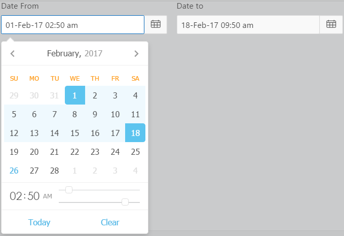

#Oracle APEX Item Plugin - DynamicDateTimePicker
DynamicDateTimePicker is an item type plugin that allows users to select date and time from a calender picker.
It is based on a JS Air datePicker (https://github.com/t1m0n/air-datepicker).


##Changelog
####1.0 - Initial Release


##Install
- Import plugin file "item_type_plugin_com_planetapex_dynamicdatetimepicker.sql" from source directory into your application
- (Optional) Deploy the CSS/JS files from "src" directory on your webserver and change the "File Prefix" to webservers folder.

##Preview


##Demo Application
[Date Picker Application](https://apex.oracle.com/pls/apex/f?p=83009:10 "DatePicker Homepage")


##Plugin Features
- 11 Types of Date and Time Picker to choose from.
- Multi-Languages, 16 Languages support
- Showing <b>Inline</b> as part of the page or <b>On Show events</b> like click, focus or mouse enter
- 8 Display Positions to choose from.
- Date validation Option.
- Custom Date Picker Title
- Previous and Forward Navigation Buttons Icons


##Plugin Settings
###Date and Time Picker Types
---
Users have many options for the Date and Time Picker types, for example:
- Single Date Picker
- Date Range Picker
- Multiple Dates Picker
- Single Month Picker
- Months Range Picker
- Multiple Months Picker
- Single Year Picker
- Years Range Picker
- Multiple Years Picker
- Time Picker Only
- Date Time Split


>**To Date(Time) Item**
>This item is used to set the 2nd Value in the following Date Picker Types
- Date Range Picker
- Month Range Picker
- Year Range Picker
- Date Time Split


###Time Picker Addon Options
Each of the Date and Time Picker Type option has an option to apend a time picker to it so that the user can select time as well.

####Date Time Separator
Separator between date and time

####Hours:Minutes Minimum Maximum

Minimum and Maximum **hours** value, must be between 00 and 23. You will not be able to choose value higher than this.

Minimum and Maximum **minutes** value, must be between 00 and 59. You will not be able to choose value higher than this.

The expression is a comma separated value between set of Minimum(Hour:Minute) and set of Maximum(Hour:Minute) as Hour:Minute,Hour:Minute
>**Do not leave any part.**

Time from start of the day to 9:30 am then enter as following: 
```javascript
00:00,9:30
```
Restricting Time From 10:30 am to 6:45 pm is as following: 
```javascript
10:30,18:45
```

___


###DatePicker Options

####Multiple Dates Separator

Multiple Dates separator is used when concatenating dates to string in the following Date Picker types:

- Multiple Dates Picker
- Multiple Months Picker
- Multiple Years Picker


####First Day of Week

Determine which day the week will be started from.

By default **Sunday** is considered as first day of the week.

Available options include:

- Sunday
- Monday
- Tuesday
- Wednesday
- Thursday
- Friday
- Saturday

####Weekends

List of day's which will be considered as weekends. Class **-weekend-** will be added to relevant cells.

By default its **Saturday** and **Sunday**.

Available options include:

- Saturday
- Sunday
- Monday
- Tuesday
- Wednesday
- Thursday
- Friday


####Minimum Date

The minimum date for date picker. All dates, running before it can't be selected.

Minimum and Maximum date usually works well with the following settings:

> Disable Navigation When Out Of Range Option. So the user also can't navigate to dates with Minimum and Maximum dates set.

The date value can be:
- an absolute value in **"DD/MM/YYYY"** or **"DD/MM/RRRR"** date format mask or
- can be dynamic based on an item substituition value.

Examples

- 02/19/2017
- Item Based . To set the minimum date to the start of the month, Create a P1_MIN_DATE hidden Item and refer it in the Minimum Date attribute as  &P1_MIN_DATE.   Set its value to start of the Month by the following After Header PL/SQL expression computation: 
```pl/sql
to_char(trunc(sysdate, 'MM'), 'MM/DD/YYYY')
```


>Remember to use the date **'MM/DD/YYYY'** OR **'MM/DD/RRRR'** format Mask. 

####Maximum Date

The maximum date for date picker. All dates, running after it can't be selected.

Minimum and Maximum date usually works well with the following settings:

>Disable Navigation When Out Of Range Option. So the user also can't navigate to dates with Minimum and Maximum dates set.

The date value can be:
- an absolute value in **"DD/MM/YYYY"** or **"DD/MM/RRRR"** date format mask or
- can be dynamic based on an item substituition value.

Examples

- 02/19/2017
- Item Based . To set the maximum date to the end of the month. Create a P1_MAX_DATE hidden Item and refer it in the Maximum Date attribute as &P1_MAX_DATE.  Set its value with the following After Header PL/SQL expression computation:
```pl/sql
to_char(last_day(sysdate), 'MM/DD/YYYY')
```


>Remember to use the date **'MM/DD/YYYY'** OR **'MM/DD/RRRR'** format Mask. 


####Show Method

Selects the method the date picker calendar displays.

Available options include:


<dt>**On item click**</dt>
<dd>The date time picker pop-up displays when the item is clicked.</dd>
<dt>**On icon click**</dt>
<dd>The date time picker pop-up displays when the icon is clicked.</dd>
<dt>**On item and icon click**</dt>
<dd>The date time picker pop-up displays when the item or icon is clicked.</dd>
<dt>**On focus**</dt>
<dd>The date time picker pop-up displays as soon as the item receives focus.</dd>
<dt>**On mouse enter**</dt>
<dd>The date time picker pop-up displays when mouse hovers over the item.</dd>
<dt>**Inline**</dt>
<dd>The date time picker will be always visible, inline with the item.</dd>


####Display Position

Position of date picker relative to text input.

- First value is name of main axis, and
- Second value is whether the Date Picker is rendered as
 - Left(Leftwards)
 - Right(Rightwards)
 - Up(Upwards)
 - Bottom(Downwards)

Available options include:

- Bottom Left
- Bottom Right
- Right Bottom
- Right Top
- Top Left
- Top Right
- Left Top
- Left Bottom

Examples

Right Top will set date picker's position from right side upwards of text input.


####DatePicker Title

Content of datepicker's title depending on current view.

There are three views in the Date Picker

- Days view i.e when selecting days,
- Months view i.e when selecting months and
- Years view i.e when selecting years.

>Missing fields will be taken from default values.

This setting can contain simple text, HTML with Styling and relevant, specific format mask. check out examples
>######<span style="color:red">Never Hard Break i.e use keyboard return in code.</span>


Examples

**For days view**:
```javascript
"days":"<span style='color:red;background-color:yellow;font-size:2em'>Check In:MM, yyyy</span>" 
```


**For months view**:
```javascript
"months":"<span style='color:red;background-color:yellow;font-size:2em'>Year:yyyy</span>" 
```

**For years view**:
```javascript
"years":"<span style='color:red;background-color:yellow;font-size:2em'>Decade:yyyy1 - yyyy2</span>" 
```

All can be **combined with comma** as following
```javascript
"days":"<span style='color:red;background-color:yellow;font-size:2em'>Check In:MM, yyyy</span>","months":"<span style='color:white;background-color:green;font-size:2em'>Year:yyyy</span>","years":"<span style='color:yellow;background-color:green;font-size:2em'>Decade:yyyy1 - yyyy2</span>"
```
___
### Miscellaneous Options:

Available options include:


<dt>**Toggle Selected**</dt>
<dd>    If checked, then clicking on selected cell will remove it from selection and its value from the item.</dd>
<dt>**Autoclose**</dt>
<dd>If checked, date picker will close after date selection.</dd>
<dt>**Keyboard Navigation**</dt>
<dd>If checked, then one can navigate through calendar by keyboard.</dd>

```    
  Hot keys:
        Ctrl + → | ↑- move one month forwards
        Ctrl + ← | ↓- move one month backwards
        Shift + → | ↑- move one year forwards
        Shift + ← | ↓- move one year backwards
        Alt + → | ↑- move 10 years forwards
        Alt + ← | ↓- move 10 years backwards
        Ctrl + Shift + ↑- move to next view
        Esc- hides date picker
```


<dt>**Today Button**</dt>
<dd>If checked, "Today" button will be visible.</dd>
<dt>**Clear Button**</dt>
<dd>If checked, "Clear" button will be visible.</dd>
<dt>**Show Days from Other Months[Days' View]**</dt>
<dd>If checked, days from other months will be visible.</dd>
<dt>**Select Days from Other Months[Days' View]**</dt>
<dd>If checked, the user can select days form other months.</dd>
<dt>**Transition to Selected Month[Days' View]**</dt>
<dd>If checked, selecting days from other month, will move to that month.</dd>
<dt>**Show other Years[Years' View]**</dt>
<dd>If checked, years from other decades will be visible.</dd>
<dt>**Select Other Years[Years' View]**</dt>
<dd>If checked, user can select years from other decades</dd>
<dt>**Transition to Selected Year[Years' View]**</dt>
<dd>If checked, selecting year from other decade, will move to that decade.</dd>
<dt>**Disable Navigation When Out Of Range**</dt>
<dd>If checked, for dates less than minimum possible or more then maximum possible, navigation buttons ('forward', 'back') will be deactivated.</dd>


___
###Languages

Available languages include:

- Chinese
- Czech
- Danish
- Deutsch(German)
- Dutch
- English
- Finnish
- French
- Hungarian
- Polish
- Portuguese
- Portuguese (Brazil)
- Romanian
- Russian
- Slovak
- Spanish


